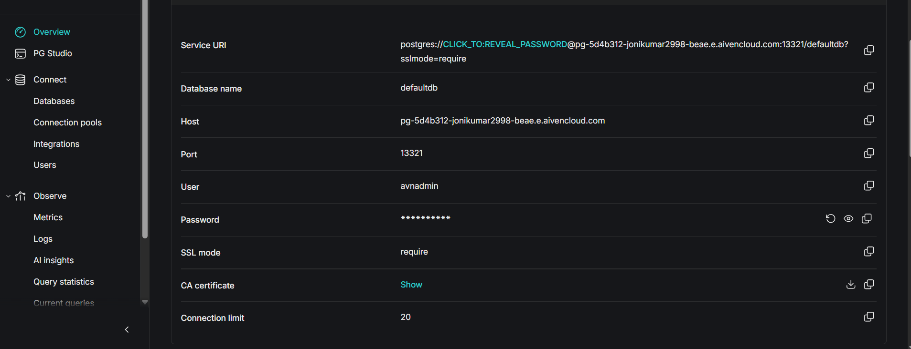
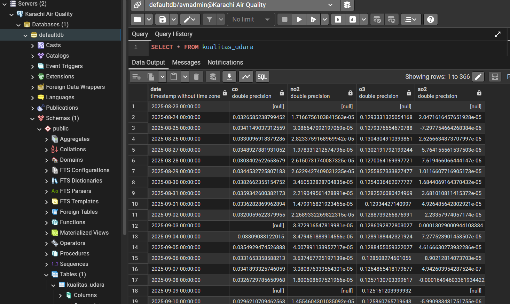
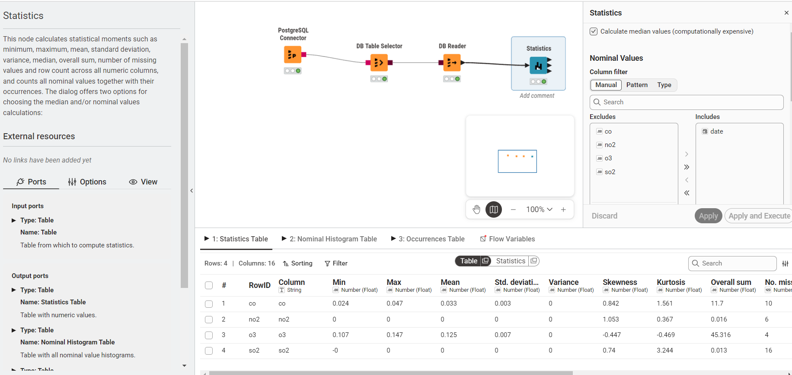
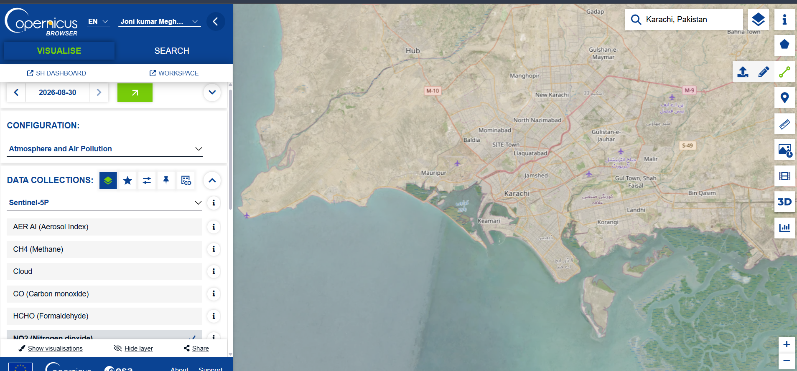
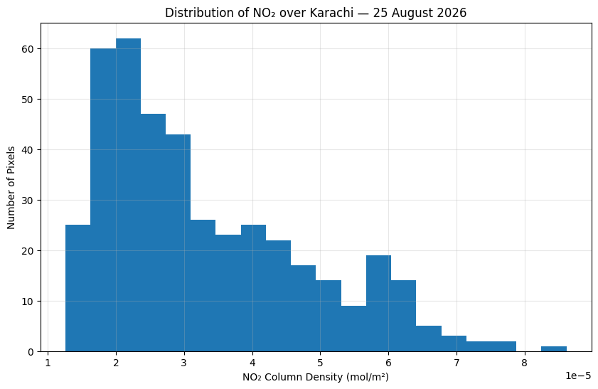
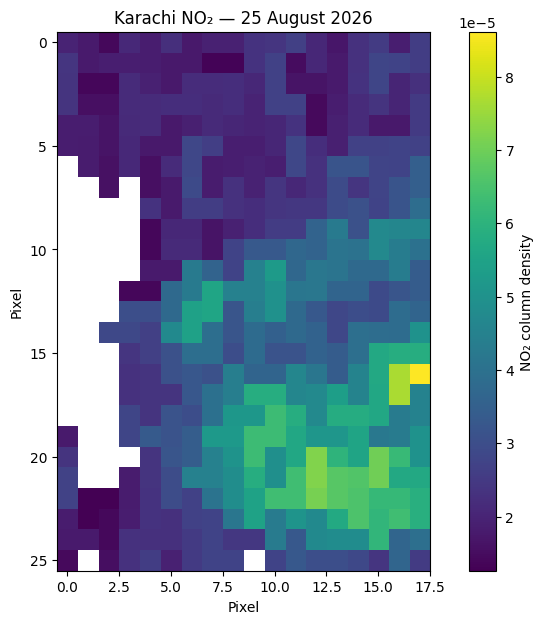

# Air Quality Data Integration in Karachi

This section documents the integration and analysis of the Karachi air-quality dataset using **Aiven PostgreSQL, pgAdmin, and KNIME**.

The dataset contains four atmospheric pollutants:

- Carbon Monoxide (CO)
- Nitrogen Dioxide (NO₂)
- Ozone (O₃)
- Sulfur Dioxide (SO₂)

The pollutant observations were obtained from the **Copernicus Data Space Ecosystem using Sentinel-5P/TROPOMI data** for the Karachi study area.

```{important}
The Sentinel-5P variables used in this project are atmospheric column observations. Their values are reported in mol/m² and should not be interpreted as ground-level pollutant concentrations or directly as Air Quality Index (AQI) values.
```

# 1. Creating a PostgreSQL Service in Aiven

A PostgreSQL database service was created using the **Aiven cloud database platform**.

The PostgreSQL service provides the database environment used to store the integrated Karachi air-quality dataset and makes the data available for database querying and analysis.



**Figure 1. Aiven PostgreSQL service used in the Karachi air-quality project.**

The project uses a PostgreSQL database with the following main connection information:

| Parameter | Value |
|---|---|
| Database system | PostgreSQL |
| Database | `defaultdb` |
| User | `avnadmin` |
| Port | `13321` |
| SSL/TLS | Required |

Sensitive information such as the database password is not included in this project.

# 2. Connecting Aiven PostgreSQL to pgAdmin

After creating the PostgreSQL service, the database was connected to **pgAdmin**.

The connection was established using the hostname, port, database name, username, and password supplied by Aiven.

The connection uses SSL/TLS to protect communication between pgAdmin and the PostgreSQL server.

The configured PostgreSQL connection is represented by the following logical structure:

```text
Aiven PostgreSQL
       |
       v
    pgAdmin
       |
       v
defaultdb
       |
       v
public schema
```

The target table used for this project is:

```text
public.kualitas_udara
```

# 3. Creating the PostgreSQL Table

The Karachi air-quality data was stored in the PostgreSQL table `kualitas_udara`.

The table was created using:

```sql
CREATE TABLE IF NOT EXISTS kualitas_udara (
    date TIMESTAMP,
    co DOUBLE PRECISION,
    no2 DOUBLE PRECISION,
    o3 DOUBLE PRECISION,
    so2 DOUBLE PRECISION
);
```

The database schema is therefore:

| Column | Data Type | Description |
|---|---|---|
| `date` | TIMESTAMP | Observation date |
| `co` | DOUBLE PRECISION | Carbon monoxide atmospheric column |
| `no2` | DOUBLE PRECISION | Nitrogen dioxide atmospheric column |
| `o3` | DOUBLE PRECISION | Ozone atmospheric column |
| `so2` | DOUBLE PRECISION | Sulfur dioxide atmospheric column |

# 4. Importing the Karachi Air Quality CSV

The four individual pollutant datasets were merged into:

```text
AirQualityKarachi.csv
```

The final CSV contains:

```text
date
co
no2
o3
so2
```

The merged dataset contains **366 date rows**.

The imported data was then loaded into the PostgreSQL table:

```text
public.kualitas_udara
```



**Figure 2. Karachi air-quality data imported into PostgreSQL using pgAdmin.**

# 5. PostgreSQL Data Validation

After importing the CSV, SQL queries were used to verify the number of rows and the number of valid values available for each pollutant.

The database validation produced the following result:

| Measurement | Count |
|---|---:|
| Total rows | 366 |
| CO values | 356 |
| NO₂ values | 360 |
| O₃ values | 362 |
| SO₂ values | 350 |
| CO missing | 10 |
| NO₂ missing | 6 |
| O₃ missing | 4 |
| SO₂ missing | 16 |

The missing values were preserved rather than replaced with artificial observations.

The dataset also contains a boundary date represented entirely by missing pollutant values. This row was retained in the 366-row dataset to remain consistent with the downloaded source structure.

# 6. Data Integration Using KNIME

The PostgreSQL database was then connected to **KNIME Analytics Platform**.

The workflow used for database integration is:

```text
PostgreSQL Connector
        |
        v
DB Table Selector
        |
        v
DB Reader
        |
        v
Statistics
```

The database table selected in KNIME is:

```text
public.kualitas_udara
```

This workflow allows the data stored in PostgreSQL to be retrieved and analyzed directly within KNIME.

# 7. KNIME Statistics

The KNIME **Statistics** node was used to calculate descriptive statistics for the four numerical pollutant columns.

The analysis includes:

- Minimum
- Maximum
- Mean
- Standard deviation
- Variance
- Skewness
- Kurtosis
- Overall sum
- Number of missing values
- Number of NaN values
- Number of positive infinity values
- Number of negative infinity values
- Median
- Row count



**Figure 3. KNIME database integration workflow and statistical results.**

The KNIME results were cross-checked against the independent Python statistical audit.

# 8. Statistical Summary

The independently calculated statistical results are shown below.

## 8.1 Descriptive Statistics

| Pollutant | Minimum | Maximum | Mean | Sample Std. Dev. | Sample Variance |
|---|---:|---:|---:|---:|---:|
| CO | 0.023594 | 0.047070 | 0.032866 | 0.003383 | 1.144269e-05 |
| NO₂ | 0.000008 | 0.000126 | 0.000043 | 0.000025 | 6.385090e-10 |
| O₃ | 0.107423 | 0.146712 | 0.125184 | 0.006939 | 4.814325e-05 |
| SO₂ | -0.000225 | 0.000396 | 0.000037 | 0.000070 | 4.881662e-09 |

## 8.2 Distribution Statistics

| Pollutant | Skewness | Fisher Kurtosis |
|---|---:|---:|
| CO | 0.842277 | 1.560970 |
| NO₂ | 1.053169 | 0.367057 |
| O₃ | -0.447387 | -0.469177 |
| SO₂ | 0.740125 | 3.243913 |

## 8.3 Overall Sum and Missing Values

| Pollutant | Overall Sum | Missing | NaNs | +∞ | -∞ |
|---|---:|---:|---:|---:|---:|
| CO | 11.700243 | 10 | 10 | 0 | 0 |
| NO₂ | 0.015627 | 6 | 6 | 0 | 0 |
| O₃ | 45.316448 | 4 | 4 | 0 | 0 |
| SO₂ | 0.013034 | 16 | 16 | 0 | 0 |

## 8.4 Median and Row Count

| Pollutant | Median | Row Count |
|---|---:|---:|
| CO | 0.032435 | 366 |
| NO₂ | 0.000035 | 366 |
| O₃ | 0.126154 | 366 |
| SO₂ | 0.000031 | 366 |

```{note}
Standard deviation and variance are reported using the sample definitions. Skewness and kurtosis follow the Fisher convention used in the Python statistical audit.
```

# 9. Interpretation of the Statistical Results

## 9.1 Carbon Monoxide (CO)

The mean CO atmospheric column value is approximately:

```text
0.032866 mol/m²
```

The positive skewness of approximately `0.842` indicates that the distribution has a longer upper tail.

The standard deviation is approximately:

```text
0.003383 mol/m²
```

which indicates the spread of CO observations around the mean.

## 9.2 Nitrogen Dioxide (NO₂)

The mean NO₂ atmospheric column value is approximately:

```text
0.000043 mol/m²
```

NO₂ has a positive skewness of approximately `1.053`, indicating a longer upper tail in the distribution.

The dataset contains 6 missing NO₂ observations.

## 9.3 Ozone (O₃)

The mean O₃ atmospheric column value is approximately:

```text
0.125184 mol/m²
```

The skewness is approximately `-0.447`, indicating a moderately longer lower tail.

O₃ has the largest mean numerical value among the four reported atmospheric quantities in this dataset.

## 9.4 Sulfur Dioxide (SO₂)

The mean SO₂ atmospheric column value is approximately:

```text
0.000037 mol/m²
```

The distribution has positive skewness of approximately `0.740`.

The dataset also contains some negative retrieved SO₂ values.

These values have not been artificially replaced with zero because doing so would modify the original retrieved dataset.

# 10. Missing Data Analysis

The number of missing observations is:

| Pollutant | Missing observations |
|---|---:|
| CO | 10 |
| NO₂ | 6 |
| O₃ | 4 |
| SO₂ | 16 |

These missing values can occur because satellite retrievals may not provide a valid observation for every time period and location.

No artificial values were inserted to replace missing observations.

The Python audit also confirms that there are no infinite values:

```text
CO   : +∞ = 0, -∞ = 0
NO₂  : +∞ = 0, -∞ = 0
O₃   : +∞ = 0, -∞ = 0
SO₂  : +∞ = 0, -∞ = 0
```

# 11. Karachi Study Area

The Sentinel-5P observations were obtained over a defined geographic area covering Karachi.

The project uses a Karachi study-area polygon approximately bounded by:

```text
West  : 66.70°
South : 24.70°
East  : 67.40°
North : 25.40°
```



**Figure 4. Karachi study area used for the Sentinel-5P analysis.**

The spatial analysis represents satellite atmospheric observations over the selected geographic area.

# 12. NO₂ Distribution

The NO₂ values were further examined using a distribution histogram.



**Figure 5. Distribution of NO₂ atmospheric column observations.**

The histogram helps visualize the frequency distribution and identify the central concentration of the observations.

# 13. NO₂ Spatial Distribution

The spatial distribution of NO₂ values was visualized using a heatmap.



**Figure 6. Spatial distribution of NO₂ over the Karachi study area.**

The spatial visualization helps demonstrate how retrieved NO₂ atmospheric column values vary geographically across the study area.

# 14. Data Processing Workflow

The overall data-science workflow used in this project is:

```text
Copernicus Data Space
        |
        v
Sentinel-5P / TROPOMI
        |
        v
Karachi Study Area
        |
        +------ CO
        |
        +------ NO₂
        |
        +------ O₃
        |
        +------ SO₂
        |
        v
Individual CSV Files
        |
        v
merge.py
        |
        v
AirQualityKarachi.csv
        |
        v
Aiven PostgreSQL
        |
        v
pgAdmin
        |
        v
KNIME
        |
        v
Statistics
```

# 15. Reproducibility

The main scripts used in the project are:

```text
scripts/
├── download_karachi.py
├── merge.py
└── quality_audit.py
```

## Download

The Sentinel-5P data acquisition script retrieves the pollutant observations from the Copernicus Data Space openEO backend.

## Merge

The `merge.py` script:

1. Loads the four pollutant CSV files.
2. Validates the required columns.
3. Parses the dates.
4. Checks for duplicate dates.
5. Merges the pollutant datasets using the observation date.
6. Preserves missing values.
7. Sorts the resulting dataset chronologically.
8. Writes `AirQualityKarachi.csv`.

## Statistical Audit

The `quality_audit.py` script independently calculates the requested statistical features directly from the merged CSV.

This provides a second validation layer against the KNIME Statistics results.

# 16. Database Validation Queries

The following SQL query was used to verify the total number of observations:

```sql
SELECT COUNT(*) AS row_count
FROM public.kualitas_udara;
```

The number of available pollutant values was checked using:

```sql
SELECT
    COUNT(*) AS total_rows,
    COUNT(co) AS co_values,
    COUNT(no2) AS no2_values,
    COUNT(o3) AS o3_values,
    COUNT(so2) AS so2_values
FROM public.kualitas_udara;
```

This confirmed:

```text
Total rows : 366
CO values  : 356
NO₂ values : 360
O₃ values  : 362
SO₂ values : 350
```

# 17. Data Quality Checks

The project performs several data-quality checks:

- Required pollutant columns are present.
- Dates are parsed successfully.
- Duplicate dates are checked.
- Missing values are counted.
- NaN values are counted.
- Positive and negative infinity values are checked.
- Data is sorted by date.
- Statistical results are independently recalculated.

The resulting data is therefore reproducible from the downloaded pollutant files and processing scripts.

# 18. Source and Measurement Notes

The project uses **Sentinel-5P/TROPOMI Level-2 atmospheric observations** obtained through the Copernicus Data Space Ecosystem.

The four pollutant variables are:

```text
CO
NO₂
O₃
SO₂
```

The values represent atmospheric column quantities.

They should therefore be interpreted as satellite-derived atmospheric observations rather than measurements from ground monitoring stations.

The project does not convert these values directly into AQI.

# 19. Conclusion

The Karachi Air Quality Data Science project integrates satellite-derived atmospheric pollutant data with cloud database and analytical tools.

The workflow successfully demonstrates:

```text
Data acquisition
      ↓
Data preparation
      ↓
CSV integration
      ↓
PostgreSQL database
      ↓
pgAdmin
      ↓
KNIME
      ↓
Statistical analysis
      ↓
Visualization
```

The final integrated dataset contains:

```text
366 rows
4 pollutant variables
CO
NO₂
O₃
SO₂
```

The database integration was successfully validated using PostgreSQL, while the statistical results were independently verified using Python and KNIME.

The project therefore demonstrates a complete data-science workflow for studying atmospheric pollutant observations over Karachi.

# 20. Project Information

**Student:** Joni Kumar Meghwar  
**NIM:** 240411100234  
**Program:** Teknik Informatika  
**Semester:** 5  
**Course:** Proyek Sains Data  
**Location:** Karachi, Sindh, Pakistan
